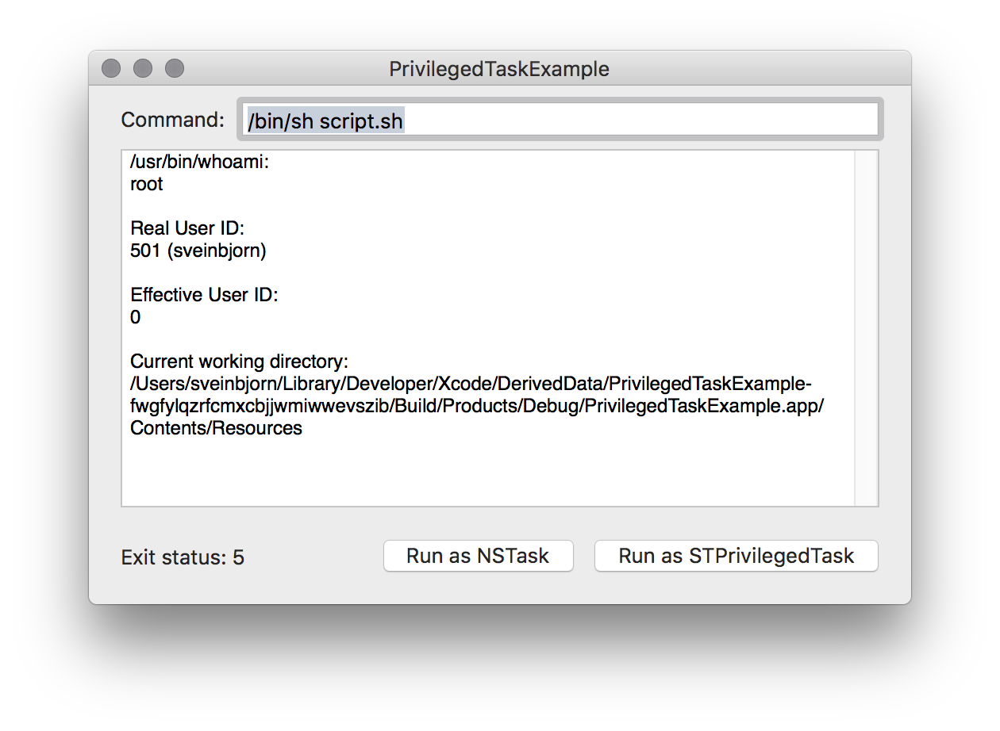

[](https://opensource.org/licenses/BSD-3-Clause)
[]()
[]()
[](https://img.shields.io/cocoapods/v/STPrivilegedTask.svg)


# STPrivilegedTask

A Cocoa-style NSTask-like wrapper class around the
[AuthorizationExecuteWithPrivileges()](https://developer.apple.com/documentation/security/1540038-authorizationexecutewithprivileg)
function in the macOS Security API to run shell commands with root privileges.
Implemented in Objective-C.

STPrivilegedTask was created a *very long time ago* (~2005) and has a long history. It has been
updated over the years to work with the latest versions of macOS (macOS 13 "Ventura" as of writing)
and is available via [CocoaPods](https://cocoapods.org). It relies on a native system function that
has been deprecated since Mac OS X 10.7 "Lion" (2011) and will fail gracefully if the function is
not available in a future version of the operating system. That being said, *caveat emptor!*

## Usage

Add the following to your `Podfile` target's dependencies:

```ruby
    pod 'STPrivilegedTask', '~> 1.0.8'
```

...or just download the two `STPrivileged.*` source files and include them directly in your project.

To import:

```objective-c
#import "STPrivilegedTask.h"
```

## Examples

### Create and launch task

```objective-c
// Create task
STPrivilegedTask *privilegedTask = [STPrivilegedTask new];
[privilegedTask setLaunchPath:@"/usr/bin/touch"];
[privilegedTask setArguments:@[@"/etc/my_test_file"]];

// Setting working directory is optional, defaults to /
// NSString *path = [[NSBundle mainBundle] resourcePath];
// [privilegedTask setCurrentDirectoryPath:path];

// Launch it, user is prompted for password (blocking)
OSStatus err = [privilegedTask launch];
if (err == errAuthorizationSuccess) {
    NSLog(@"Task successfully launched");
}
else if (err == errAuthorizationCanceled) {
    NSLog(@"User cancelled");
} 
else {
    NSLog(@"Something went wrong, error %d", err);
}

// NB: STPrivilegedTask changes the current working directory of the entire process
// using chdir(). This is not thread-safe and can lead to unexpected behavior
// if your program does other things while the task is running.

```
See [Authorization.h](http://www.opensource.apple.com/source/libsecurity_authorization/libsecurity_authorization-36329/lib/Authorization.h)
for a list of possible error codes.

### Launch task one-liner

```objective-c
OSStatus err = [STPrivilegedTask launchedPrivilegedTaskWithLaunchPath:@"/bin/sh" 
                                                            arguments:@[@"/path/to/script.sh"]];
```


### Getting task output

```objective-c
// ... Launch task

[privilegedTask waitUntilExit]; // This is blocking

// Read output file handle for data
NSData *outputData = [[privilegedTask outputFileHandle] readDataToEndOfFile];
NSString *outputString = [[NSString alloc] initWithData:outputData 
                                               encoding:NSUTF8StringEncoding];

```

### Getting output while task runs in background

```objective-c

// ... Launch privilegedTask

NSFileHandle *readHandle = [privilegedTask outputFileHandle];
[[NSNotificationCenter defaultCenter] addObserver:self
                                         selector:@selector(getOutputData:)
                                             name:NSFileHandleReadCompletionNotification
                                           object:readHandle];
[readHandle readInBackgroundAndNotify];

// ...

- (void)getOutputData:(NSNotification *)aNotification {
    // Get data from notification
    NSData *data = [[aNotification userInfo] objectForKey:NSFileHandleNotificationDataItem];
    
    // Make sure there's actual data
    if ([data length]) {
        // Do something with the data
        NSString *outputString = [[NSString alloc] initWithData:data 
                                                       encoding:NSUTF8StringEncoding];
        NSLog(@"%@", outputString);
        
        // Go read more data in the background
        [[aNotification object] readInBackgroundAndNotify];
    } else {
        // Do something else
    }
}
```

### Task termination

You can observe STPrivilegedTaskDidTerminateNotification:

```objective-c
[[NSNotificationCenter defaultCenter] addObserver:self
                                         selector:@selector(privilegedTaskFinished:)
                                             name:STPrivilegedTaskDidTerminateNotification
                                           object:nil];

- (void)privilegedTaskFinished:(NSNotification *)aNotification {
    // Do something
}
```

Or alternatively set a termination handler block:

```objective-c
privilegedTask.terminationHandler = ^(STPrivilegedTask *privilegedTask) {
    NSLog(@"Terminating task: %@", [privilegedTask description]);
};
```

### Launch using external AuthorizationRef

```objective-c
// ... Create your own AuthorizationRef

[STPrivilegedTask launchedPrivilegedTaskWithLaunchPath:@"/bin/sh"
                                             arguments:@"/path/to/script"
                                      currentDirectory:@"/"
                                         authorization:authRef]
```

###  AuthorizationExecuteWithPrivileges() is deprecated

[AuthorizationExecuteWithPrivileges()](https://developer.apple.com/library/mac/documentation/Security/Reference/authorization_ref/#//apple_ref/c/func/AuthorizationExecuteWithPrivileges)
is deprecated as of macOS 10.7 but still remains available in macOS 13 "Ventura". If you want to be 
future-proof, here's how you check if STPrivilegedTask works in the running version of macOS:

```objective-c
// ...create privilegedTask object

OSStatus err = [privilegedTask launch];
if (err == errAuthorizationFnNoLongerExists) {
    NSLog(@"AuthorizationExecuteWithPrivileges not available");
    // Do something to handle the situation
}
```

If you need to check whether STPrivilegedTask works before you launch the task:

```objective-c
BOOL works = [STPrivilegedTask authorizationFunctionAvailable];
```

## Sample app

A sample app which makes use of STPrivilegedTask is included in the project. This app runs the following script:

```
#!/bin/sh

echo "/usr/bin/whoami:"
whoami
echo ""
echo "Real User ID:"
echo $UID \($USER\)
echo ""
echo "Effective User ID:"
/usr/bin/id -u
echo ""
echo "Current working directory:"
echo "$PWD"

exit 5
```

It waits for the script to finish and then shows the output in a window, along with the exit code.



## BSD License 

Copyright (c) 2008-2025 Sveinbjorn Thordarson &lt;sveinbjorn@sveinbjorn.org&gt;
All rights reserved.

Redistribution and use in source and binary forms, with or without modification,
are permitted provided that the following conditions are met:

1. Redistributions of source code must retain the above copyright notice, this
list of conditions and the following disclaimer.

2. Redistributions in binary form must reproduce the above copyright notice, this
list of conditions and the following disclaimer in the documentation and/or other
materials provided with the distribution.

3. Neither the name of the copyright holder nor the names of its contributors may
be used to endorse or promote products derived from this software without specific
prior written permission.

THIS SOFTWARE IS PROVIDED BY THE COPYRIGHT HOLDERS AND CONTRIBUTORS "AS IS" AND
ANY EXPRESS OR IMPLIED WARRANTIES, INCLUDING, BUT NOT LIMITED TO, THE IMPLIED
WARRANTIES OF MERCHANTABILITY AND FITNESS FOR A PARTICULAR PURPOSE ARE DISCLAIMED.
IN NO EVENT SHALL THE COPYRIGHT HOLDER OR CONTRIBUTORS BE LIABLE FOR ANY DIRECT,
INDIRECT, INCIDENTAL, SPECIAL, EXEMPLARY, OR CONSEQUENTIAL DAMAGES (INCLUDING, BUT
NOT LIMITED TO, PROCUREMENT OF SUBSTITUTE GOODS OR SERVICES; LOSS OF USE, DATA, OR
PROFITS; OR BUSINESS INTERRUPTION) HOWEVER CAUSED AND ON ANY THEORY OF LIABILITY,
WHETHER IN CONTRACT, STRICT LIABILITY, OR TORT (INCLUDING NEGLIGENCE OR OTHERWISE)
ARISING IN ANY WAY OUT OF THE USE OF THIS SOFTWARE, EVEN IF ADVISED OF THE
POSSIBILITY OF SUCH DAMAGE.
